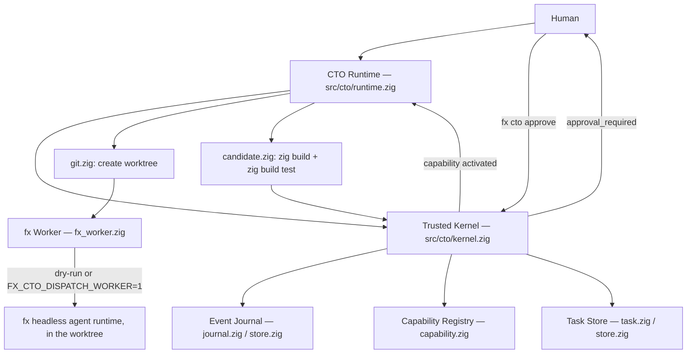

# fx CTO PoC

A small proof-of-concept for a **self-extending CTO runtime** layered on top
of the `fx` coding harness in this repository. It validates one hypothesis:

> A minimal CTO can detect that it lacks a capability, create work against
> its own repository, delegate the implementation to a coding worker,
> validate the candidate with a real build and test run, and report that a
> new capability is ready for human approval.

This is **not** another coding-agent harness. `fx` remains the harness;
`src/cto/` is a thin, separately-composed layer above it.

## Try it

```console
$ fx cto status
CTO runtime: ready
counterpart: cto-dev
worker: fx
capabilities: 6 available, 1 missing
pending tasks: 0

$ fx cto request "watch merged pull requests"
CTO created self-extension task #1 for `github.pull_request.merged`; a candidate is ready and requires approval.
Run `fx cto approve 1` to activate it, or `fx cto events` to review the audit trail.

$ fx cto approve 1
Approved task #1; capability activated.

$ fx cto capabilities
...
github.pull_request.merged: available (candidate/task-1)
...
```

State lives in `.cto/` inside whatever directory you run `fx cto` from:
`capabilities.json`, `tasks.json`, the append-only `events.jsonl` journal,
and `versions/task-<id>.json` audit records. `worktrees/task-<id>/` holds
each task's isolated git worktree.

## Architecture



| Module | Owns |
|---|---|
| `kernel.zig` | task lifecycle, approval boundary, orchestrating persistence |
| `capability.zig` | the capability registry (`available` / `missing` / `candidate` / `disabled`) |
| `task.zig` | the `Task` model and its lifecycle states |
| `event.zig` / `journal.zig` | the append-only audit event stream |
| `store.zig` | all `.cto/` JSON/JSONL persistence — the only file I/O in the kernel |
| `counterpart.zig` | the fixed `cto-dev` engineer identity |
| `worker.zig` | the type-erased worker interface |
| `fx_worker.zig` | adapter to the headless fx agent runtime injected by the composition root |
| `git.zig` | `git worktree add`, nothing else |
| `candidate.zig` | runs `zig build` / `zig build test` inside a worktree |
| `workspace.zig` | pure path formatting (worktree path, candidate branch name) |
| `runtime.zig` | wires the above into the `request()` bootstrap loop |
| `main.zig` | CLI parsing for `fx cto <command>` |
| `extensions/` | where a self-generated connector is meant to land, never the kernel |

The task owns its worktree, not the worker: `runtime.zig` creates the
worktree before the worker ever runs, and passes the worker only a path
that already exists. The kernel never deletes a worktree or a failed task;
every attempt — successful or not — is left on disk for a human to inspect.

## Integration point

`fx cto ...` is intercepted in `src/main.zig`, inside `mainC`, immediately
after the top-level CLI arguments are extracted and before any of fx's
interactive/TUI/session bootstrap runs:

```zig
if (cli_args.len > 0 and std.mem.eql(u8, cli_args[0], "cto")) {
    exitFast(cto_main.run(processAllocator(), cli_args[1..], environBlockFromRaw(raw_env)));
}
```

This was a deliberate choice over wiring `cto` into `command_specs.zig` /
`cli_surface.zig`'s full `TopLevelKind` registry (the `ask`/`status`/`doctor`/…
command surface). That registry is large, heavily used by the interactive
help system, and threads through `app_entry_runtime`'s full `Config`
plumbing (provider sets, MCP runtime, auth, tool sets, …) — none of which
CTO needs. `cto` intentionally stays a separate, minimal composition root:
it owns its own `std.Io.Threaded` instance and never touches `App`. The
cost is that `fx cto` does not appear in `fx --help`; running `fx cto` or
`fx cto help` with no further arguments prints its own help text instead.

## Capabilities

The bootstrap set (`capability.zig`):

```
filesystem.read        available
filesystem.write       available
git.worktree           available
worker.fx              available
self.build             available
self.test              available
github.pull_request.merged   missing   <- what the demo bootstraps
```

`github.pull_request.merged` is deliberately absent from the checked-in
registry: shipping a real GitHub connector would defeat the point of the
demo, which is proving CTO can *notice* a gap and *responsibly acquire* the
capability, not proving it can poll GitHub's API.

## The worker: what "real" means here, and what doesn't (yet)

`fx_worker.zig` does not hand-roll a second coding harness. It:

1. writes the implementation prompt to `<worktree>/.cto-task-prompt.md` as a
   durable record of what cto-dev was asked to do;
2. stops there in dry-run mode (the default — see below), or calls a typed
   runner injected by `src/main.zig`;
3. in live mode, switches into the isolated worktree and invokes fx's
   existing `cli_ask` headless agent/session runtime directly with yolo
   permissions and session persistence disabled.

**Dispatch is dry-run by default.** A bare `fx cto request` must never
silently spend model credits, need network access, or need live
credentials just to demonstrate the bootstrap loop — and this PoC was
built and tested in a sandboxed environment with no model access at all.
Set `FX_CTO_DISPATCH_WORKER=1` to have it invoke the fx agent runtime live.
`--yolo` (fx's existing flag to skip its own permission prompts) is safe
here specifically because the worker only ever runs inside the isolated
worktree the kernel just created — the isolation boundary is the worktree
and the approval gate before activation, not per-tool-call permission
checks during generation.

Either way, **`self.build` / `self.test` always run for real**: `candidate.zig`
always shells out to `zig build` and `zig build test` inside the worktree
and records the actual pass/fail, whether or not a live model touched the
code. In dry-run mode this mostly proves the pipeline (worktree → build →
test → candidate → approval) end to end against an unmodified checkout;
with `FX_CTO_DISPATCH_WORKER=1` and real model credentials it validates
whatever the fx agent actually changed.

## Observations, connectors, and ingestion

`extension_contract.zig` defines the seam a connector implements:
`Connector.normalize(RawEvent) -> ?Observation`, where a raw event is just
`{event_name, delivery_id, body}` and an `Observation` (`observation.zig`)
is a provider-neutral fact with provenance (provider, delivery id,
repository, URL). `src/cto/extensions/github_events.zig` is the first
connector: it normalizes a GitHub `pull_request` webhook only when
`action: closed` and `merged: true`, and it's registered in
`extensions/registry.zig` so its tests run in the normal `zig build test`
graph.

`fx cto ingest <event-name> <delivery-id>` reads a raw event body from
stdin and runs it through every registered connector. An observation a
connector produces is deduplicated by `(provider, delivery_id)` and
persisted to `.cto/observations.jsonl`; `fx cto observations` lists what's
been recorded. This is deliberately the boring half of "ingestion": there
is no webhook receiver, no signature verification, and no network I/O
here — something else has to hand `fx cto ingest` a trusted body. See
Limitations.

```console
$ echo '{"action":"closed","pull_request":{"number":42,"merged":true,"merged_at":"2024-01-15T10:30:00Z", ...}}' \
    | fx cto ingest pull_request delivery-abc
connector `github-events` recorded an observation for `github.pull_request.merged`
$ fx cto observations
[github] org/repo#42 "..." merged by ... (delivery-abc)
```

## Human-channel bridge

`channel.zig` parses Telegram-style slash text (`/status`, `/goals`,
`/runs`, `/decisions`, `/approve <id>`, `/interrupt <id>`) into a
provider-neutral `Command`. `fx cto channel "<command>"` dispatches it —
but only ever to the same views and actions the rest of the CLI already
exposes (`kernel.approve`, the same printers). It grants no new authority;
it's a second entry point onto the existing one, with no network
transport or bot credential wired up yet. `/interrupt` is an honest
no-op today (worker cancellation isn't implemented).

## Self-modification safety

- Self-generated work happens only inside `.cto/worktrees/task-<id>/`, a
  real `git worktree`, never the checkout `fx cto` is running from.
- A candidate becomes `available` in the capability registry only via
  `fx cto approve <id>`, which requires the task to already be in
  `approval_required` (i.e., build and test both passed). There is no
  automatic activation path.
- The kernel never overwrites the running `fx` binary. "Activation" here
  means flipping a capability's status in `.cto/capabilities.json`; wiring
  an approved candidate into a rebuilt, redeployed `fx` binary is future
  work (see Limitations).
- A failed task, and any worktree it left behind, is never deleted
  automatically — `fx cto events` and `fx cto tasks` are the audit trail.
- `src/cto/extensions/` is documented as the intended boundary for
  self-proposed connectors; nothing in `kernel.zig`, `journal.zig`,
  `store.zig`, or the approval path in `main.zig` should ever be a target
  of self-generated changes.

## Known limitations / what's next

- **No webhook receiver, no Telegram transport, no daemon.** `fx cto
  ingest` and `fx cto channel` are the trusted-side halves of ingestion
  and human control; nothing here listens on a socket, verifies a webhook
  signature, or authenticates a Telegram chat. A long-running process that
  does that — plus an authenticated local API, retries/timeouts/deadlines
  for workers, `/interrupt` actually cancelling a run, and durable
  project-memory beyond raw observations — is real, security-sensitive
  infrastructure work that's deliberately not in this PoC. See
  `docs/SPEC.md` for the fuller roadmap this PR was scoped against.
- **The GitHub connector was authored directly, not generated live.** This
  PoC has no model credentials to actually drive `fx cto request` through
  a live worker run, so `github_events.zig` is a reviewed, hand-written
  reference implementation of the target shape — not evidence that the
  live loop reliably generates working connectors end to end.
- **Activation is registry-only.** Approving a task flips
  `.cto/capabilities.json`; it does not merge the candidate branch, restart
  the running binary, or otherwise make the new code live. That "atomic
  version switch + restart + rollback if unhealthy" step described in the
  original design notes is intentionally out of scope for this PoC.
- **No cleanup command.** Worktrees and candidate branches accumulate under
  `.cto/worktrees/` and as local `candidate/task-N` branches. A
  `fx cto tasks --gc` or similar is a natural follow-up, not included here
  so failed attempts stay inspectable by default.
- **No timeout on `zig build` / `zig build test`.** A hung build hangs
  `fx cto request`. `std.process.RunOptions.timeout` exists and would be a
  small follow-up.
- **`.cto/` has no locking.** Each `fx cto` invocation reads the whole
  state, mutates it, and rewrites it; concurrent invocations in the same
  directory can race. Fine for a single operator driving this by hand, not
  fine for anything automated/concurrent.
- **CLI output goes to stderr** (`std.debug.print`), not stdout, matching
  the original PoC overlay. Worth reconciling with fx's stdout/stderr
  convention (see `writeStdoutFast` in `src/main.zig`) in a follow-up.
- **`fx cto` isn't in `fx --help`** — see "Integration point" above.

## Demo flow (fresh checkout, offline)

```console
$ mkdir /tmp/demo && cd /tmp/demo && git init -q && git commit -q --allow-empty -m seed
$ fx cto status
$ fx cto request "watch merged pull requests"
$ fx cto goals
$ fx cto runs
$ fx cto decisions
$ fx cto tasks
$ fx cto events
$ fx cto approve 1
$ fx cto capabilities
$ echo '{"action":"closed","pull_request":{"number":1,"merged":true,"merged_at":"2024-01-15T10:30:00Z","title":"...","html_url":"...","user":{"login":"..."},"merged_by":{"login":"..."},"head":{"sha":"..."},"base":{"ref":"main"}},"repository":{"full_name":"org/repo"}}' \
    | fx cto ingest pull_request delivery-1
$ fx cto observations
```

This runs entirely offline (dry-run worker) and still exercises the real
git worktree, the real `zig build`/`zig build test` (which will fail here
since `/tmp/demo` has no `build.zig` — that's expected and is exactly the
"never crash, always leave an audit trail" behavior this PoC is meant to
demonstrate). Run it against a real Zig project instead of an empty repo,
or set `FX_CTO_DISPATCH_WORKER=1` with real fx credentials, to see the
candidate reach `approval_required`.
